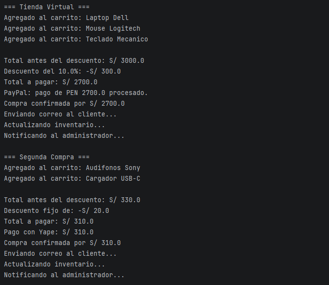

# Virtual-Store-S07-Lab

Tienda virtual por consola que aplica tres patrones de diseño: Strategy, Adapter y Observer.

---

## Patrón Strategy - Descuentos

Se define la interfaz `DiscountStrategy` con tres implementaciones intercambiables.
`OrderService` delega el cálculo del descuento sin conocer cuál estrategia está activa.

| Clase | Comportamiento |
|---|---|
| `NoDiscountStrategy` | No aplica ningún descuento |
| `PercentageDiscountStrategy` | Descuento porcentual sobre el total |
| `FixedAmountDiscountStrategy` | Descuento de monto fijo |

---

## Patrón Adapter - Métodos de pago

`ExternalPayPalService` tiene una firma incompatible con la interfaz interna `PaymentProcessor`.
`PayPalAdapter` traduce la llamada sin modificar ninguna de las dos clases.
`YapePaymentProcessor` y `CreditCardPaymentProcessor` implementan `PaymentProcessor` directamente.

---

## Patrón Observer - Notificaciones

Al confirmar la compra, `OrderService` notifica automáticamente a todos los observadores registrados:
`EmailNotificationObserver`, `InventoryObserver` y `AdminNotificationObserver`.

---

## Salida completa

